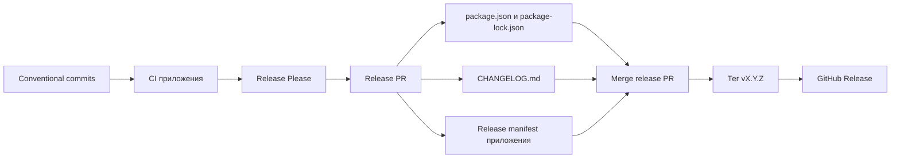

# Архитектура Monino Tools

## Репозитории и зоны ответственности

Monino Tools состоит из четырёх репозиториев:

| Репозиторий | Ответственность |
| --- | --- |
| `monino-tools-api` | API, схема данных, миграции и работа с изображениями |
| `monino-tools-admin` | Интерфейс администратора |
| `monino-tools-user` | Публичный каталог и точка запуска production workflow |
| `monino-tools-nginx` | Compose, nginx, backup, deploy, rollback и состав production-релиза |

Корневой репозиторий подключает API, admin и user как Git submodule. Каждый его
коммит поэтому указывает на точный commit каждого приложения. Production никогда
не обновляет submodule через `--remote`: workflow получает уже зафиксированное дерево
из неизменяемого корневого тега.

## Два уровня версий

### Версия приложения

API, admin и user версионируются независимо по SemVer. В каждом репозитории версия
хранится в `package.json` и `package-lock.json`, а выпущенная версия закрепляется:

- тегом `vMAJOR.MINOR.PATCH`;
- GitHub Release;
- записью в `CHANGELOG.md`;
- точным commit SHA.

Одинаковый номер тега в разных репозиториях не означает один общий релиз. Например,
`api/v1.2.0` и `user/v1.2.0` являются независимыми версиями разных приложений.

### Состав production-релиза

Совместимая комбинация приложений фиксируется в корневом `release.env`:

```dotenv
RELEASE_VERSION=YYYY.MM.DD.N
INFRA_VERSION=MAJOR.MINOR.PATCH
API_VERSION=MAJOR.MINOR.PATCH
API_COMMIT=<40-character SHA>
ADMIN_VERSION=MAJOR.MINOR.PATCH
ADMIN_COMMIT=<40-character SHA>
USER_VERSION=MAJOR.MINOR.PATCH
USER_COMMIT=<40-character SHA>
```

`RELEASE_VERSION` — CalVer-идентификатор конкретного развёртывания. Он отличает
несколько production-комбинаций, созданных в один день. `INFRA_VERSION` — SemVer
корневого репозитория и его неизменяемого тега. Версии приложений и SHA определяют,
какие именно исходники входят в эту комбинацию.

Таким образом, новый тег приложения только делает версию доступной для релиза.
Production изменяется лишь после обновления `release.env`, проверки и deployment
корневого тега.

## Выпуск версии приложения



Новые commit-сообщения проверяются в CI. Основные правила:

- `fix:` увеличивает patch;
- `feat:` увеличивает minor;
- `type!:` или `BREAKING CHANGE:` увеличивает major;
- `docs:`, `refactor:`, `perf:`, `build:`, `ci:`, `test:`, `style:`, `chore:` и
  `ops:` описывают остальные изменения.

Release Please создаёт и поддерживает release PR. Слияние этого PR обновляет
версию пакета и changelog, затем создаёт тег и GitHub Release. Теги вручную для
обычного выпуска приложения не создаются.

## Подготовка production-релиза

Для новой production-комбинации:

1. Выбираются уже выпущенные версии API, admin и user.
2. Submodule корневого репозитория переключаются на commits этих версий.
3. В `release.env` записываются их SemVer и полные SHA.
4. `RELEASE_VERSION` получает следующий CalVer-номер.
5. `INFRA_VERSION` увеличивается, чтобы создать новый неизменяемый корневой тег.
6. `validate-release.sh` проверяет `VERSION`, `release.env`, версии пакетов и SHA
   submodule.
7. Корневой CI проверяет shell-скрипты, Compose, production-образы, backup/restore
   и очистку изображений.
8. После успешного CI создаётся корневой тег `v<INFRA_VERSION>`.

Корневой тег является единственным входом для `verify` и `deploy`. Ветка `main`
не используется как плавающий источник production-релиза.

## Production workflow

Production workflow сейчас находится в `monino-tools-user` и запускается вручную.
Там хранятся GitHub Environment `production` и секреты подключения к VPS. Сам
состав релиза при этом читается из выбранного тега `monino-tools-nginx`.

Доступны операции:

| Операция | Назначение |
| --- | --- |
| `audit` | Состояние VPS, диска, Docker и работающих контейнеров без изменений |
| `verify` | Изолированная проверка указанного корневого тега на копии production-данных |
| `deploy` | Развёртывание ранее проверенного корневого тега |
| `rollback` | Возврат предыдущих Docker-образов и повторный smoke-тест |
| `cleanup` | Удаление временного verify-окружения и Docker cache |

Одновременно выполняется только одна production-операция.

### Verify

`verify` получает точный корневой тег вместе с submodule, передаёт дерево релиза на
VPS и создаёт отдельный Compose-проект. В него копируются dump текущей PostgreSQL и
архив volume изображений. Затем workflow:

1. проверяет release manifest;
2. собирает три тестовых образа;
3. восстанавливает копии БД и изображений;
4. дважды запускает миграции, проверяя их идемпотентность;
5. ждёт healthcheck API, admin и user;
6. выполняет внутренние smoke-тесты;
7. удаляет временные контейнеры, volumes и образы.

Verify не переключает production-контейнеры.

### Deploy

`deploy.sh` сначала проверяет manifest и сравнивает целевые Docker-теги с текущими
контейнерами. Дальше он:

1. собирает только сервисы с изменившейся версией;
2. запрещает повторное использование SemVer для другого commit SHA;
3. создаёт и проверяет backup PostgreSQL, изображений и release manifest;
4. запускает миграции и очистку потерянных изображений только при изменении API;
5. заменяет только изменившиеся контейнеры;
6. ждёт их состояния `healthy`;
7. выполняет smoke-тесты;
8. переключает `/root/monino-tools-current` на каталог нового релиза.

Docker-образ получает тег SemVer и дополнительный тег полного commit SHA. Метки OCI
сохраняют revision и номер общего релиза.

### Rollback

Перед переключением deploy сохраняет версии работающих образов в
`.previous-release.env`. Rollback проверяет наличие всех трёх образов, запускает их,
ждёт healthcheck и выполняет smoke-тест.

Миграции БД автоматически назад не откатываются. Изменения схемы должны следовать
модели `expand -> migrate -> contract`, чтобы предыдущая версия приложения могла
работать с уже расширенной схемой. Полное восстановление данных выполняется отдельно
из проверенного backup.

## Инварианты релизной системы

- Production всегда описывается `release.env` из неизменяемого корневого тега.
- Версия приложения всегда соответствует его `package.json` и Git-тегу.
- Одна SemVer-версия не может указывать на два разных commit SHA.
- Неизменившийся сервис не пересобирается и не перезапускается.
- Миграции запускаются только при изменении API.
- Перед миграцией и переключением контейнеров создаётся проверенный backup.
- Секреты остаются в GitHub Environment и `.env` на VPS; в Git и release manifest
  записываются только несекретные версии и SHA.
- Rollback приложения не означает автоматический rollback данных.

## Связанные документы

- `RELEASING.md` — практическая процедура подготовки версий и release manifest.
- `DEPLOYMENT.md` — эксплуатация VPS, backup, restore и ручные проверки.
- `PROJECT_PLAN.md` — история этапов и оставшиеся production-проверки.
